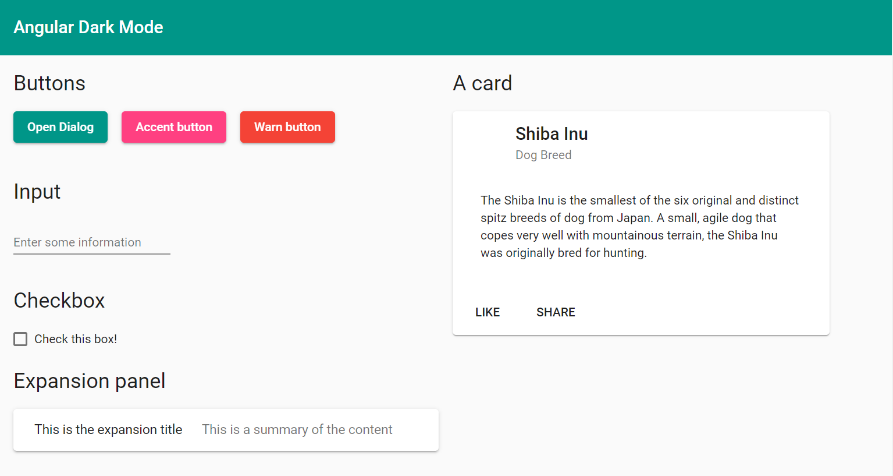
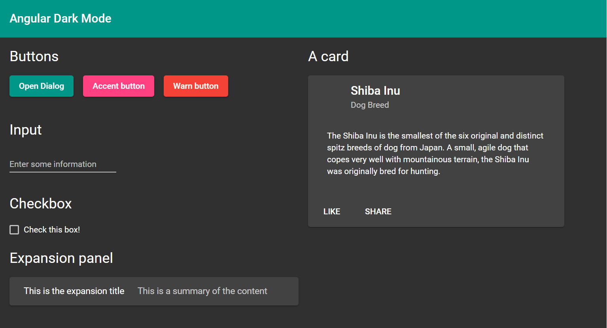
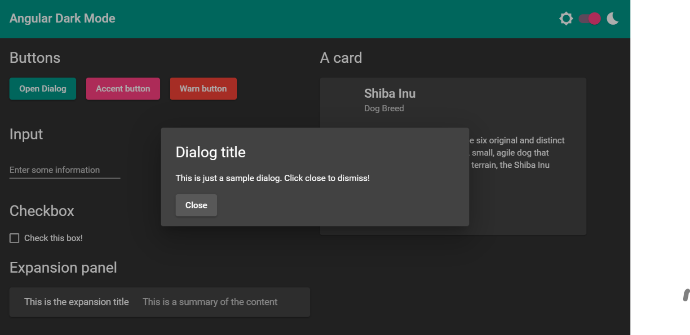

# Angular Material Dark Mode in 3 steps

Source: [blog](https://zoaibkhan.com/blog/angular-material-dark-mode-in-3-steps/), [github](https://github.com/thisiszoaib/angular-dark-mode), [twitter](https://twitter.com/zoaibdev).

## Step 1: Add a custom angular material theme

The Angular Material components library comes bundled with a few themes which we can use for your app.
But for adding a dark mode, you need to add a custom theme file instead.
A sample custom theme looks like the following.

```scss
@use '~@angular/material' as mat;

@import "~@angular/material/theming";

@include mat.core();

$angular-primary: mat.define-palette(mat.$teal-palette, 500, 100, 900);
$angular-accent: mat.define-palette(mat.$pink-palette, A200, A100, A400);

$angular-warn: mat.define-palette(mat.$red-palette);

$angular-default-theme: mat.define-light-theme(
  (
    color: (
      primary: $angular-primary,
      accent: $angular-accent,
      warn: $angular-warn,
    ),
  )
);

@include mat.all-component-themes($angular-default-theme);
```

Add this to the `styles.scss` file of your project.
The important bits here are the `primary`, `accent` and `warn` colors.
The colors are actually fetched from material design palettes which consist of 19 base colors and their light, dark and contrast variations.
For more details, please refer to the [material design color page](https://material.io/design/color/the-color-system.html#tools-for-picking-colors).

In our case, according to the theme above, we have a teal color as the `primary` color, pink as the `accent` color and red as the `warn` color. This will be our default ‘light’ theme and looks like this.



I’ve just added some basic material components, so we can see the effect of the theme changes.
Feel free to customize as you want.

Do you want to use colors not there in the material design color palettes?
You can create a theme with custom colors using [this super useful online tool](https://www.nikhilwalvekar.com/ng-mat-theme-generator/) and just copy paste the generated theme in your styles as above.

For adding the dark mode theme, we just need to add an alternate theme to the theme file.

```scss
$angular-dark-theme: mat.define-dark-theme(
  (
    color: (
      primary: $angular-primary,
      accent: $angular-accent,
      warn: $angular-warn,
    ),
  )
);

.darkMode {
  @include mat.all-component-colors($angular-dark-theme);
}
```

To add a dark theme, we used material’s predefined function `mat-dark-theme`, instead of `mat-light-theme` in our default theme.
This ensures that background and foreground colors are set correctly for the dark mode.
Then we include the color configuration changes inside of a class name (which we named ourselves) i.e. `darkMode`.

One last tweak to get the background and foreground color working is to add the class `mat-app-background` to our parent container in `app.component.html`.

Now whenever we add this class name to any HTML container, it will apply the dark theme to all of its children.
So if we apply the class to the parent div in our `app.component.html`, this is what we’ll get.



## Step 2: Adding the dark mode toggle behavior

We need to add the toggle button to allow the users to switch between the light and dark mode at runtime. Let’s add the toggle button first.

```html
<mat-toolbar color="primary">
  Angular Dark Mode
  <div class="flex-stretch"></div>
  <mat-icon class="mr-8">brightness_5</mat-icon>
  <mat-slide-toggle [formControl]="toggleControl" class="mr-8">
  </mat-slide-toggle>
  <mat-icon>bedtime</mat-icon>
</mat-toolbar>
```

We’ve added a material slide toggle component and used two material icons to indicate light and dark mode on either side.
We’ve bound it to a reactive form control in our component.

```ts
toggleControl = new FormControl(false);
```

We also introduce a [HostBinding](https://angular.io/api/core/HostBinding) for our root app component, so we can use the same for setting the class dynamically.
The `HostBinding` allows us to add the class to the component itself, rather than any of its children, thus removing the need for us to add any explicit parent container inside.

```ts
@HostBinding('class') className = '';
```

Then, it’s just a matter of listening to the toggle component’s changes and modifying our class name.
We do this in the `ngOnInit` lifecycle event.

```ts
ngOnInit(): void {
    this.toggleControl.valueChanges.subscribe((darkMode) => {
      const darkClassName = 'darkMode';
      this.className = darkMode ? darkClassName : '';
    });
}
```

If you test out your code now, you’ll see a toggle nicely switching between the light and dark mode.
The background, foreground and component colors should be adjusting to the dark mode automatically.

## Step 3: Fixing the material dialog and other overlays

Some Angular Material components such as the dialog and floating menu are rendered in an overlay container, instead of the root component’s hierarchy.
So when you apply the dark mode, it won’t apply to them.

To fix this, we need to add the `darkMode` to the overlay container dynamically through code.
Here is how we can add to our listener for the toggle control.

```ts
constructor(private overlay: OverlayContainer) { }
ngOnInit(): void {
    this.toggleControl.valueChanges.subscribe((darkMode) => {
      const darkClassName = 'darkMode';
      this.className = darkMode ? darkClassName : '';
      if (darkMode) {
        this.overlay.getContainerElement().classList.add(darkClassName);
      } else {
        this.overlay.getContainerElement().classList.remove(darkClassName);
      }
    });
}
```

Firstly, we include the `OverlayContainer` in your app component.
Then, we simply add and remove our `darkMode` class as the toggle is switched on and off.
To test this, we’ve added a simple material dialog in our app, which opens up with the first primary button.
The dialog now follows the dark mode theme just like the other components.



We now have “proper” dark mode for our Angular material app, which spans all of our material components, the background and the foreground colors.

If you got the gist of this, however, you can use this method to actually add any number of alternate themes to your Angular material app.
For instance, you could allow the user to choose which of the themes he/she may want to use depending their preferences (you could store those in localStorage e.g).

You could also use different themes for different areas of your application, giving a nice touch of branding to different sections of the app.
Now that you understand the basics, you can go on and develop it as you see fit.
